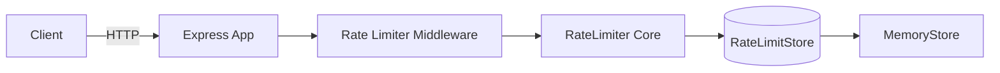

# 🚦 Distributed Rate Limiter 

A clean, production-style **rate limiting system** built with **Node.js, Express, and TypeScript**.  

Implements **fixed-window** and **token-bucket** algorithms with a pluggable store design, currently featuring an **in-memory store** (v1). Future releases will introduce Redis for distributed multi-instance scaling.

--- 

## ✨ Why this project exists

This project demonstrates:

- Practical implementation of real-world rate limiting algorithms  

- Clean separation of concerns:

  - core algorithm logic  

  - persistence layer  

  - HTTP integration  

- Readable TypeScript abstractions using interfaces & composition  

- A portfolio-level example of Express middleware design  

--- 

## 🧱 Architecture



### Component responsibilities

| Component | Purpose |
|-----------|---------|
| Client | Issues requests (Browser / Postman / curl / load test) |
| Express App | API server |
| Middleware | Inspects request, determines policy, enforces limits |
| RateLimiter Core | Implements fixed-window & token-bucket logic |
| RateLimitStore | Abstract persistence interface |
| MemoryStore | In-memory implementation of RateLimitStore |

## 📂 Project Structure

```
rate-limiter/
├─ src/
│  ├─ config/                     # rate-limit rules based on route/key
│  │  └─ rateLimits.ts
│  ├─ lib/                        # core algorithm & storage abstractions
│  │  ├─ types.ts
│  │  ├─ store.ts
│  │  ├─ memoryStore.ts
│  │  └─ rateLimiter.ts
│  ├─ middleware/                 # Express middleware wrapper
│  │  └─ rateLimiterMiddleware.ts
│  └─ server/                     # Express app setup
│     └─ app.ts
├─ package.json
├─ tsconfig.json
├─ README.md
└─ LICENSE
```

## 🛠 Tech stack

- Node.js (TypeScript)
- Express
- ts-node-dev (development)
- (Planned) Redis for distributed store

## 🚀 Getting started

### 1. Clone

```bash
git clone https://github.com/anubhav217/distributed-rate-limiter.git
cd distributed-rate-limiter
```

### 2. Install dependencies

```bash
npm install
```

### 3. Run (dev)

```bash
npm run dev
```

You should see:

```
Rate-limited API listening on http://localhost:3000
```

## 🌐 Endpoints & example limits

| Method | Path | Description | Example limit (v1) |
|--------|------|-------------|-------------------|
| GET | `/` | Welcome message | — |
| GET | `/health` | Health check | — |
| GET | `/login` | Example login endpoint | Fixed window — 5 req/min |
| GET | `/api/data` | Example data endpoint | Token bucket — 100 req/min |

## 🔬 Testing examples

### Example: /health

```bash
curl.exe -i http://localhost:3000/health
```

### Example: /api/data (token bucket)

```bash
curl.exe -i http://localhost:3000/api/data
```

### Exceeded limit response

```
HTTP/1.1 429 Too Many Requests
{"error":"too_many_requests","message":"Rate limit exceeded. Please try again later."}
```

## 🧠 How rules are resolved

Located in `src/config/rateLimits.ts`:

```ts
if (req.path.startsWith('/login')) {
  return {
    algorithm: 'fixed-window',
    rule: { maxRequests: 5, windowMs: 60_000 }
  };
}

return {
  algorithm: 'token-bucket',
  rule: { maxRequests: 100, windowMs: 60_000, bucketCapacity: 100 }
};
```

## 🧩 Core abstractions

### RateLimitStore — `src/lib/store.ts`

- `incrementWindowCounter(key, windowMs)`
- `consumeToken(key, capacity, refillRatePerSec)`

### MemoryStore — `src/lib/memoryStore.ts`

Simple in-memory implementation for development / single-instance setups.

### DefaultRateLimiter — `src/lib/rateLimiter.ts`

Implements:
- fixed-window logic
- token-bucket logic

### Middleware — `src/middleware/rateLimiterMiddleware.ts`

Extracts client key (`x-api-key` if present, else IP)

## 🧪 Tests (planned)

- Jest + ts-jest
- Unit tests
- Edge case testing for both algorithms
- Integration with supertest

## 🛣 Roadmap

- [ ] Implement RedisStore for distributed rate limiting
- [ ] Add docker-compose (API + Redis)
- [ ] Add Jest tests (unit + integration)
- [ ] Per-API-key / per-plan limits
- [ ] Optional usage dashboard (React)
- [ ] Publish core rate-limiter as an npm package

## 🧾 .gitignore

```
/node_modules
/dist
.env
.DS_Store
*.log
```

## 📜 License

MIT License — see LICENSE.

## 👤 Author

**Anubhav Majumdar**

- GitHub: https://github.com/anubhav217
- LinkedIn: https://www.linkedin.com/in/anubhav-majumdar/

